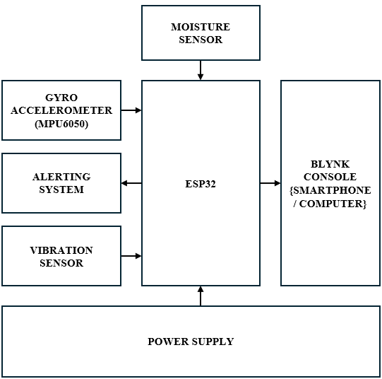
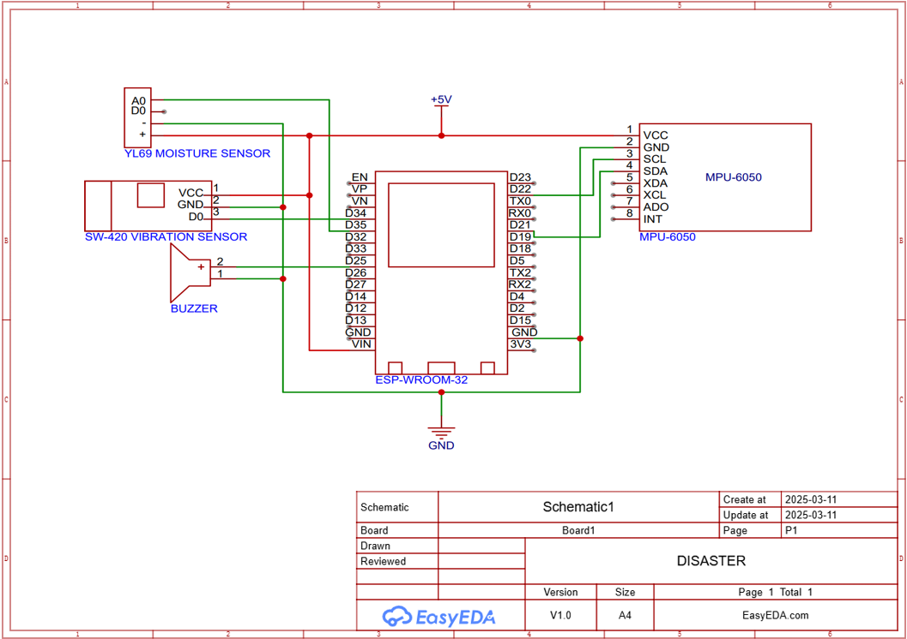

# 🌪️ Smart Disaster Detection and Alerting System

An IoT-based disaster detection and alerting solution that monitors soil moisture, ground vibration, and tilt angle to predict and alert about earthquakes or landslides. Built using ESP32, Blynk, and multiple sensors, it provides real-time alerts via buzzer and mobile dashboard.

## 🚀 Features

- Real-time monitoring of moisture, vibration, and tilt
- Blynk IoT cloud integration for remote alerts
- Immediate buzzer alarm on disaster risk detection
- Automatic alerts when thresholds are breached
- Low-cost, scalable, and energy-efficient design

## 🧰 Hardware Used

| Component              | Description                     |
|------------------------|---------------------------------|
| ESP32                  | Main microcontroller with WiFi  |
| YL-69 Moisture Sensor  | Measures soil water content     |
| SW-420 Vibration Sensor| Detects seismic vibrations      |
| MPU6050                | Detects tilt and motion         |
| Buzzer                 | Audible local alert             |

## 🖼️ System Architecture

## 🔧 Circuit Diagram

## 🛠️ How It Works

1. Moisture sensor detects soil saturation.
2. MPU6050 measures tilts.
3. Vibration sensor detects seismic activity.
4. ESP32 processes and triggers buzzer + Blynk alert.

## 💻 Software Stack

- Arduino IDE
- Blynk IoT platform
- EasyEDA (for circuit design)

## 📂 Repository Structure

| Folder         | Contents                         |
|----------------|----------------------------------|
| `firmware/`    | ESP32 code                       |
| `firebase/`    | Blynk config                     |
| `web-dashboard/`| Dashboard structure description |
| `docs/`        | Explanation, block, literature   |
| `images/`      | Diagrams and screenshots         |
| `videos/`      | Demo files (if any)              |
| `extras/`      | Project report (PDF)             |

## 👨‍💻 Team

- Aadil Muhammed  
- Beval Philip Mathew  
- Rahul B  
- Sibi B John  

